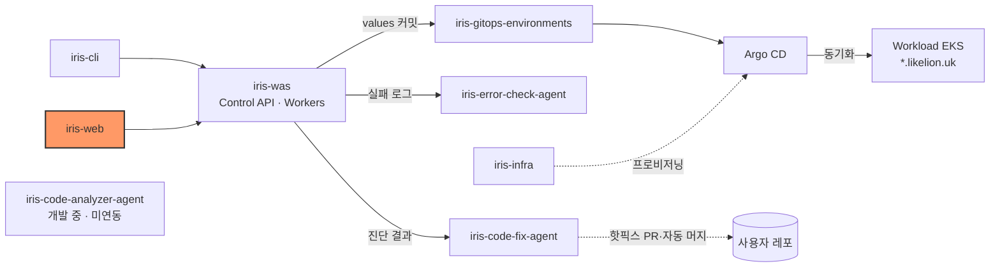
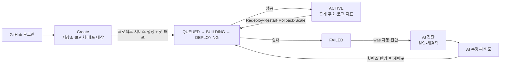

# iris-web

Likelion의 웹 대시보드다. GitHub 저장소를 골라 서비스를 만들고, 배포·로그·지표를 보고, 실패한 배포를 AI로 진단·수정한다. 모든 데이터는 [iris-was](https://github.com/2026-softbank-1/iris-was) Control API에서 온다.


## 시스템 내 위치



- 호출 대상: [iris-was](https://github.com/2026-softbank-1/iris-was) (`/api/v1`). 같은 API를 [iris-cli](https://github.com/2026-softbank-1/iris-cli)도 쓴다.
- AI 진단·수정은 was가 [iris-error-check-agent](https://github.com/2026-softbank-1/iris-error-check-agent)·[iris-code-fix-agent](https://github.com/2026-softbank-1/iris-code-fix-agent)를 호출한 결과를 보여 준다.

## 주요 흐름



## 스크린샷

<!-- TODO: 스크린샷 추가 (대시보드, 배포 상세, AI 진단 화면)


-->

## 구현 범위

| 화면 | 상태 |
|---|---|
| 로그인·로그아웃 (GitHub OAuth, 세션 쿠키) | WAS 연동 |
| Dashboard 프로젝트 목록, 커맨드 팔레트 | WAS 연동 |
| Create (저장소 검색·브랜치·배포 대상 AWS/온프레미스·첫 배포) | WAS 연동 |
| 프로젝트 캔버스, 서비스 상태·공개 주소 | WAS 연동 |
| 서비스 Deployments (Deploy·Redeploy·Restart·Rollback), 배포 Details | WAS 연동 |
| 배포 Build·Deploy·Network Logs | WAS 연동 |
| 프로젝트 Logs (과거 + SSE 실시간) | WAS 연동 |
| 서비스 Metrics (CPU·Memory, ALB 트래픽 지표) | WAS 연동 |
| 서비스 Variables (Raw Editor 포함) | WAS 연동 |
| 서비스·프로젝트 Settings (Scale, 배포 방식 롤링·카나리·블루그린, 삭제) | WAS 연동 |
| AI 진단 (자동 시작·재진단·근거 로그) | WAS 연동 |
| AI 수정·재배포 (자동 핫픽스, 환경변수 문제는 수동 안내) | WAS 연동 |
| 서비스 Console | 샘플 (고정 응답 셸) |
| Observability, Sandboxes, Templates | 샘플이라 숨김 (코드에 주석 처리) |
| 워크스페이스 이름 | 샘플 (`src/data/mock.ts`) |
| Usage | 샘플 (라우트 비활성) |

화면별 엔드포인트와 상세 동작은 [docs/screens-and-api.md](docs/screens-and-api.md)에 있다.

## 기술 스택

- React 19, TypeScript 5.9, Vite 8 (Rolldown)
- React Router 7, React Flow(`@xyflow/react`) 캔버스, `lucide-react` 아이콘
- 디자인: Toss Design System 규칙을 데스크톱용으로 조정 (`.claude/skills/toss-design/`, [CLAUDE.md](CLAUDE.md))
- 다국어: ko·ja·en ([I18N.md](I18N.md))

## 디렉터리 구조

```
src/
  auth/        로그인 상태(/me)
  components/  공통 UI, 커맨드 팔레트, Create 다이얼로그
  data/        was 응답 → 화면 모델, 폴링 훅, 샘플 데이터(mock.ts)
  dev/         VITE_MOCK_API=1 용 가짜 API
  i18n/        ko·ja·en 문구
  layouts/     Workspace·Project 레이아웃
  lib/         API 클라이언트(api.ts), 엔드포인트(endpoints.ts)
  pages/       페이지와 서비스·배포 패널
  styles/      디자인 토큰과 화면별 CSS
docs/          상세 문서
```

## 빠른 시작

Node.js 22.12 이상.

```sh
npm install
npm run dev          # http://localhost:5173/dashboard
npm run typecheck && npm run build
```

- `VITE_API_BASE_URL`: was 주소. 기본 `http://localhost:8000`. 바꾸려면 `.env.example`을 `.env.local`로 복사한다.
- 로그인은 was의 `WEB_BASE_URL`과 웹 주소가 같아야 한다(`npm run dev -- --port 3000` 또는 was 쪽 값을 5173으로). `127.0.0.1`이 아니라 `localhost`로 접속한다.
- was 없이 화면만 보려면 `.env.local`에 `VITE_MOCK_API=1`을 넣는다(`src/dev/mockApi.ts`가 답한다).

프록시·CORS, macOS 샌드박스(Rolldown WASI) 등 상세는 [docs/local-development.md](docs/local-development.md).

## 인터페이스 요약

- was REST `/api/v1`만 호출한다. 인증은 was가 발급한 세션 쿠키(credentials 포함), 401이면 `/login`으로 보낸다.
- 실시간 로그는 SSE(`/services/{id}/logs/stream`), 진행 중인 배포·진단·수정은 폴링한다.
- 배포·Scale·AI 수정 요청에는 `Idempotency-Key`를 붙인다.
- 계약 원문은 was 문서(`docs/deployment-details-api.md`, `docs/diagnosis-api.md` 등)를 따른다.

## 배포

- AWS Amplify가 `npm run build` 결과물을 `likelion.uk`에 호스팅한다.
- 빌드 시 API 주소는 커밋된 `.env.production`(`https://api.likelion.uk`)이고, Amplify 환경 변수 `VITE_API_BASE_URL`이 있으면 그 값이 우선한다. 빈 문자열은 같은 origin 호출이 되므로 넣지 않는다.
- 이 레포에는 GitHub Actions 워크플로가 없다. 빌드 트리거는 Amplify 콘솔 설정을 따른다.

## 현재 상태 / 한계

- 위 구현 범위의 샘플 화면은 was API가 없다. 결제·초대·계정 관리, 회원가입·온보딩은 없다.
- MVP 범위 밖이라 뺀 항목: 워크스페이스 People, 프로젝트 Members, 외부 문서 링크.
- `/traffic-metrics`가 없는 was에서는 트래픽 지표 카드가 '지표가 없어요' 빈 상태다.
- mock 모드(`VITE_MOCK_API=1`)에는 AI 수정 시나리오가 없다.
- 데스크톱 화면 기준이다. GitHub avatar 표시는 외부 네트워크가 필요하다.
- 화면 문구·코드에는 아직 `LikeLion` 표기가 남아 있다(README·docs만 `Likelion`으로 정리).

## 문서

- [docs/screens-and-api.md](docs/screens-and-api.md): 화면 ↔ 엔드포인트, 로그·지표·Scale·Variables·AI 진단·AI 수정 동작, 제한 사항, 코드 구조, 검증 기록
- [docs/local-development.md](docs/local-development.md): 로컬 실행 상세
- [I18N.md](I18N.md): 다국어 용어집
- [CLAUDE.md](CLAUDE.md): 디자인 작업 규칙
